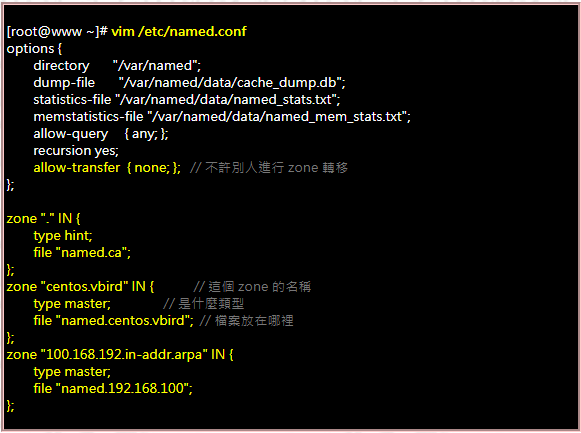

### 安装配置

- 安装

- 配置文件

- zone配置文件
  
  - SOA记录
  
  - NS记录

- dns server测试

#### 安装

##### 在线安装

```bash
yum -y install bind bind-chroot
# bind-chroor 用于改变named运行的范围
```

##### 离线安装

在ref/named下有经测试能够在 CentOS-7.5上安装成功的安装。

#### 配置文件

##### 准备配置文件

在使用了yum安装之后，默认named运行涉及的范围是所有文件，即其实的根目录是`/`。需要使用bind-chroot对应的工具去改变 named 运行的根目录，提高安全性。并且把需要用到的模板文件复制到对应的新位置。<br>

<font color='red'>由于named在运行时是使用一个在named用户组下的账号进行运行，所以需要保证named 用户组对文件有读的权限，否则会导致dns记录解析不正确。</font>

```bash
# 修改 named 的运行根目录
sudo /usr/libexec/setup-named-chroot.sh /var/named/chroot on

# 复制配置文件到新的目录 /var/named/chroot 中的对应位置。
sudo cp -R /usr/share/doc/bind-*/sample/var/named/* /var/named/chroot/var/named/

# 创建一些必须的文件。
## 处理 var/named/data 文件夹下的文件
sudo mkdir -p /var/named/chroot/var/named/data/
sudo touch /var/named/chroot/var/named/data/cache_dump.db
sudo touch /var/named/chroot/var/named/data/named_stats.txt
sudo touch /var/named/chroot/var/named/data/named_mem_stats.txt
sudo touch /var/named/chroot/var/named/data/named.run
sudo chmod 664 /var/named/chroot/var/named/data/*
## 处理 var/named/dynamic 文件夹下的文件
sudo mkdir -p /var/named/chroot/var/named/dynamic
sudo touch /var/named/chroot/var/named/dynamic/managed-keys.bind
sudo chmod 664 /var/named/chroot/var/named/dynamic/*

sudo mkdir /var/named/chroot/etc/
sudo cp -f /etc/named.rfc1912.zones /var/named/chroot/etc/named.rfc1912.zones
sudo cp -f /etc/named.root.key /var/named/chroot/etc/named.root.key

sudo chgrp -R named /var/named/chroot
```

##### 配置`etc/named.conf`

`named.conf`配置路径是，相对于named根目录的`etc/named.conf`，并且内部配置的文件路径也是按照named根目录的相对路径。

准备好文件之后就要配置 etc/named.conf。



**option配置项**

文件路径相关：

- directory：配置除了named.conf以外的配置文件的路径。

访问控制相关：

- allow-query: 允许发出查询机子的IP范围。可选，any，none，IP地址，子网（如 192.168.1.0/24）

- listen-on：配置监听位置，一般配置为 listen-on port 53 { any; };。如果any更换成 localhost，则DNS server 只会接受来自localhost的请求。

- recursion：是否递归查询。

**allow-query 和 listen-on的区别是，listen-on是首先控制是否接收来自指定ip的请求，allow-query是控制接收到请求后，是否对请求做处理。**

**zone文件相关配置**

**named.conf中的 zone 配置。zone 配置分两种，一种配置正向解析，另一种配置反向解析。**

```bash
# 正向解析例子
zone "named-test.com" { #被解析的域名。任何匹配到该模式的都会由该zone文件解析。

        type master; # 可以为 master，slave 和 hint

        file "named-test.com.zone"; # 指定zone 文件的位置

};
```

<font color='red'>需要注意的是：不能在同一个DNS server中，配置两个相同前缀的 zone。比如a.test.com 和 test.com。</font><br>

<font color='red'>在编写完成之后可以使用 named-checkconf 命令检查格式及配置是否正确。</font>

```bash
named-checkconf -t /var/named/chroot 
# -t 表示修改后运行的根目录。
```

#### zone文件配置

##### dns记录类型

dns 记录的格式如下:

```
name [TTL] [class] type value
```

- ttl：存活时间，以秒为单位。表示数据项的缓存有效时间

- class：指定网络类型，默认类型为IN，IN(指Internet)、HS(Hesiod:本地使用的目录服务)、CH(供域名服务器内部用来标示自己)

dns记录最重要是配置 name，type 和value。<br>

<font color='red'>在dns记录中，最重要的是域名如果没有以“.”结尾，着代表的相对域名路径，其相对的是该zone对应的域名。</font>

其中type包含以下常见的类型：

- SOA：配置每个zone文件负责解析哪个域。

- A：配置一个域名对应的地址

- NS：授权当前zone中的某个子区域给其他服务器解析。

- CNAME：配个某个规范域名的别名。

##### SOA

SOA：（Start Of Authority）主要配置用于主从DNS服务器同步的信息。**在zone文件中必须配置一个并且只配置一个 soa记录。**

```bash
# SOA 记录格式，采用zone文件里面的格式。；后面的内容代表注释。
name [TTL] [IN] SOA <master domain name> <admin emain> (
    <Serial>
    <Refresh>
    <Retry>
    <Expire>
    <Minumum TTL>
)
```

- master domain name：DNS主机的域名。

- admin email：这里配置的地址中用"."，替换“@”。比如123@123.com,要写成 123.123.com.。记得最后要加"."。

- serial：序列号。一般格式为 YYYYMMDDNU。比如2019072701，其中01代表7月27日的第2个版本。

- Refresh：设置slave向master请求更新的时间。以秒为单位。

- Retry：连接master失败后重试的时间。以秒为单位

- Expired：一直无法连接到master，则该slave失效的时间。

- Minumum TTL：

##### A记录

**A，或者AAAA：代表指定域名对应的IP。**

##### NS记录

**NS：当请求的域名为 name时，向该记录的value对应的域名请求解析。**

```bash
www.baidu.com IN NS com.
```

- 上面的例子代表的意思是，如果请求是 www.baidu.com，那么就向com. 的域名服务器请求解析。
- **注意，需要在当前区域再配置一个NS服务器域名对应的地址解析。**

##### CNAME记录

CNAME：该记录定义了一个域名别名

[更多详细的关于dns记录请看鸟哥的DNS Server](http://linux.vbird.org/linux_server/0350dns.php#DNS_master_rr)

#### dns server测试

在linux中可以采用dig命令测试dns server是否能够正常解析域名。

**需要安装对应的软件包 bind-utils。**

```bash
dig <domain name>

# 如果测试的不是配置在 /etc/resolv.conf 中的dns server，可以只用通过@指定
dig @<dns server to test> <domain name>
```
