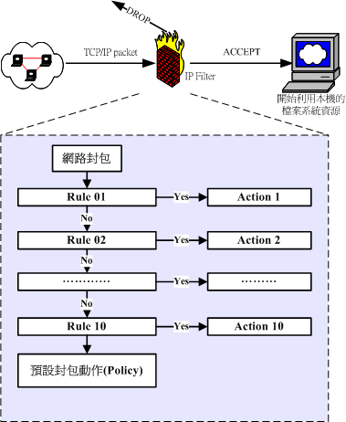
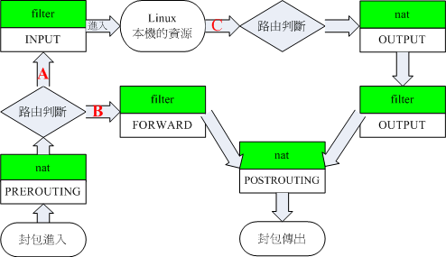

#### iptables

iptables是在linux中的一款封包过滤防火墙。这个防火墙主要有几个过滤规则的表格，每个表格中又包含若干条规则链用于过滤流量。

##### 规则链

一条规则链内包含和多条规则，iptables会根据这些规则过滤网络流量。并且<font color='red'>每条规则之间的相对顺序是非常重要的。</font>下图是规则链的原理示意图。这种过滤结构类似逻辑判断中的逻辑短路，当满足其中某一条的时候就会采取对应的action。



##### 规则表

iptables中有几个规则表，分别控制不同位置的网络流量。下图是简化后的示意图（主要是忽略了不常用的mangle）。图中主要描述了每个表中的规则链所控制的位置。



#### 规则表配置

##### 规则表清除

- iptables -F ：清除所有的已訂定的規則；

- iptables -X ：殺掉所有使用者 "自訂" 的 chain (應該說的是 tables ）囉；

- iptables -Z ：將所有的 chain 的計數與流量統計都歸零

##### 规则表保存

/etc/init.d/iptables save

##### 规则项配置

**在action中 DROP 和 REJECT的区别：**

当选择 DROP 时，有可能源机器会不断发送 SYN 请求，导致带宽占用，而 REJECT 则只会请求几次次之后就会停止。

###### 通过网络设备过滤

通过 “-i” 或者 “-o” 参数控制从某个设备是否能够通过流量。可选值有：

- lo ：local的简写，一般指本地环回接口。相当于能够接受来自localhost 的流量。

- 网络设备名称： 如 eth0 （通常是以太网卡），wifi0（通常是wifi网卡）

在不配置其他选项时，默认对所有条件都应用所配置的action，如：

```bash
# 相当于配置 lo 为受信任设备。
iptables -A -io lo -j ACCEPT
```

###### 通过 ip 和 端口过滤

配置格式如下

```bash
iptables [-AI 添加位置] [-io 网络设备] [-p tcp,udp] \

> [-s 来源IP/网络] [--sport 端口范围] \

> [-d 目标IP/网络] [--dport 端口范围] -j [ACCEPT|DROP|REJECT]
```

注意点：

- 除了 -p 条件外，其他条件不配置都表示的是不进行限制。

- 在配置了 --sport 或者 --dport 时，必须要指定采用的是tcp 还是 udp 协议。

- --sport 和 --dport 都可以通过 \<port start\>:\<port end\> 的方式表示端口范围。

- -s 和 -d 都可以通过 \<network ip\>/\<subnet mask number\> 的方式表示一个子网。

###### 规则项中的 -m 和 state

出现这两个参数的原因是为了方便，过滤INPUT流量，因为如果不通过 state 过滤流量，则我们都要对所有我们要访问的ip开放 1024::65535 端口，因为我们要接收这些ip返回的信息。而有了 state 就可以直接通过state 只放行是已经建立好连接的流量。

#### iptables 配置工具

[ref/iptables](ref/iptables)中有一套配置iptables 的工具，避免每次开机或者修改都要手动一条条的重新执行设置语句。
