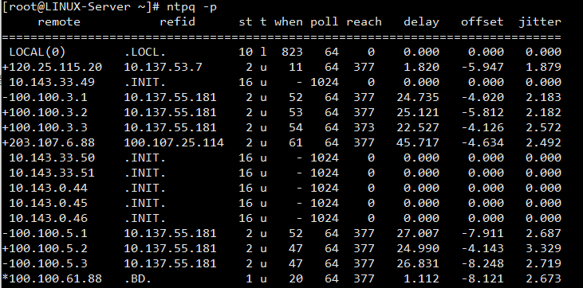

#### 时间同步

- 安装

- 状态检查

- 配置

- 公共同步服务器


##### 安装

检查是否安装

```bash
rpm -qa | grep ntp
```

安装

```bash
yum install ntp
```

开机自启动

```bash
chkconfig ntpd on
```

##### 状态检查

###### 检查时间服务器状态

通过`ntpq -p`命令查看所有配置了的候选的时间同步服务器的状态，如是否可用，延迟等。



最开始的字符表示该ntp服务器的状态，有`*`表示正在使用，`+`表示可以连接，`-`表示无法连接。

- refid：该ntp参考的远程ntp地址。

- st：ntp对应的startnum，当startnum为16时，表示该ntp不能连接。

- when：几秒前左的同步

- poll：下次更新在几秒后

- reach：连接到该ntp的次数

- delay：连接的延迟。单位是微妙

- offset：时间不长，单位是毫秒

- jitter：系统时间和硬件时间的差异。单位是微妙

##### 配置文件

###### restrict选项

用于进行访问控制，限制客户端和远程时间同步服务器能进行的操作。

- kod： 向不安全的访问者发送Kiss-Of-Death报文。即不提供任何服务

- ignore：忽略所有类型的NTP连接请求  

- nomodify：限制客户端不能使用命令ntpc和ntpq来修改服务器端的时间 

- noquery：不提供NTP网络校时服务 

- notrap：不接受远程登录请求  

- notrust：不接受没有经过认证的客户端的请求

- default：代表该选项是默认选项。

示例：

```bash
restrict default kod nomodify notrap nopeer noquery     # <==拒绝 IPv4 的用户
restrict -6 default kod nomodify notrap nopeer noquery  # <==拒绝 IPv6 的用户
```

通常服务端的配置

```bash
restrict 192.168.100.0 mask 255.255.255.0 nomodify <==放行局域网用户来源，或者列出单独IP
```

###### server选项

用于配置候选的远程时间同步服务器。

配置选项：

- minpoll： 指定与查询该服务器的最小时间间隔为2的n次方秒，n默认为6，范围为4-14。

- maxpoll：  指定与查询该服务器的最大时间间隔为2的n次方秒，n默认为10，范围为4~14。

- iburst： 当初始同步请求时，采用突发方式接连发送8个报文，时间间隔为2秒。

- prefer：优先选择的服务器。

- mode：报文的mode字段

- version：往上层服务器发送报文的版本号。默认是3

- key：表示所有发往服务器的报文包含有秘钥加密的认证信息，n是32位的整数，表示秘钥号。

###### 局域网服务器配置样例

```bash
driftfile /var/lib/ntp/drift
##下面两行默认是拒绝所有来源的任何访问
restrict default kod nomodify notrap nopeer noquery
restrict -6 default kod nomodify notrap nopeer noquery
#开放本机的任何访问
restrict 127.0.0.1
restrict -6 ::1
# 允许内网其他机器同步时间(允许192.168.1.0/24 网段主机进行时间同步)
restrict 192.168.1.0 mask 255.255.255.0 nomodify notrap
#指定ntp服务器地址
server 192.168.33.44
#允许上层时间服务器主动修改本机时间
restrict 192.168.33.44 nomodify notrap noquery
#外部时间服务器不可用时，以本地时间作为时间服务
server  127.127.1.0
fudge   127.127.1.0 stratum 10
##下面两行为配置文件默认开启
includefile /etc/ntp/crypto/pw
keys /etc/ntp/keys
```

###### 局域网客户端配置样例

```bash
tinker panic 0 #（这行意思是设置客户端与服务器端时间差距，默认最大为1000，为0为不限制。）

server 192.168.245.128 prefer  minpoll 3 maxpoll 3 #（minpoll表示客户端向服务器端同步的最少时间，单位为2的次幂最小为3，秒）

server 192.168.245.130 iburst  minpoll 3 maxpoll 3 #（maxpoll表示客户端向服务器端同步的最长时间，单位为2的次幂最大为10，秒）

restrict 192.168.245.128
restrict 192.168.245.130
```
