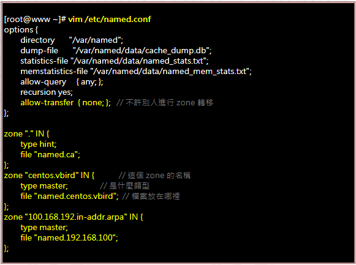

#### 安装配置

##### 安装

###### 在线安装

```bash
yum -y install bind bind-chroot
# bind-chroor 用于改变named运行的范围
```

###### 离线安装

在ref/named下有经测试能够在 CentOS-7.5上安装成功的安装。

##### 配置文件

在使用了yum安装之后，默认named运行涉及的范围是所有文件，需要使用bind-chroot对应的工具去改变 named 运行的根目录。并且把需要用到的模板文件复制到对应的新位置。<br>

<font color='red'>由于named在运行时是使用一个在named用户组下的账号进行运行，所以需要保证named 用户组对文件有读的权限，否则会导致dns记录解析不正确。</font>

```bash
# 修改 named 的运行根目录
sudo /usr/libexec/setup-named-chroot.sh /var/named/chroot on

# 复制配置文件到新的目录 /var/named/chroot 中的对应位置。
sudo cp -R /usr/share/doc/bind-*/sample/var/named/* /var/named/chroot/var/named/

# 创建一些必须的文件。
## 处理 var/named/data 文件夹下的文件
sudo mkdir -p /var/named/chroot/var/named/data/
sudo touch /var/named/chroot/var/named/data/cache_dump.db
sudo touch /var/named/chroot/var/named/data/named_stats.txt
sudo touch /var/named/chroot/var/named/data/named_mem_stats.txt
sudo touch /var/named/chroot/var/named/data/named.run
sudo chmod 664 /var/named/chroot/var/named/data/*
## 处理 var/named/dynamic 文件夹下的文件
sudo mkdir -p /var/named/chroot/var/named/dynamic
sudo touch /var/named/chroot/var/named/dynamic/managed-keys.bind
sudo chmod 664 /var/named/chroot/var/named/dynamic/*

sudo cp /etc/named.rfc1912.zones etc/named.rfc1912.zones
sudo cp /etc/named.root.key etc/named.root.key

sudo chgrp -R named /var/named/chroot
```

准备好文件之后就要配置 etc/named.conf。



- allow-query: 允许发出查询机子的IP范围。可选，any，none，IP地址，子网（如 192.168.1.0/24）

- listen-on：配置监听位置，一般配置为 listen-on port 53 { any; };。如果any更换成 localhost，则DNS server 只会接受来自localhost的请求。

- recursion：是否递归查询。

**allow-query 和 listen-on的区别是，listen-on是首先控制是否接收来自指定ip的请求，allow-query是控制接收到请求后，是否对请求做处理。**

<font color='red'>named.conf 中的文件路径都是相对于 named 运行根目录的路径。</font>

**named.conf中的 zone 配置。zone 配置分两种，一种配置正向解析，另一种配置反向解析。**

```bash
# 正向解析例子
zone "named-test.com" { #被解析的域名。任何匹配到该模式的都会由该zone文件解析。

        type master; # 可以为 master，slave 和 hint

        file "named-test.com.zone"; # 指定zone 文件的位置

};
```

<font color='red'>需要注意的是：不能在同一个DNS server中，配置两个相同前缀的 zone。比如a.test.com 和 test.com。</font><br>

<font color='red'>在编写完成之后可以使用 named-checkconf 命令检查格式及配置是否正确。</font>

```bash
named-checkconf -t /var/named/chroot 
# -t 表示修改后运行的根目录。
```

#### zone文件配置

##### dns记录类型

dns 记录的格式如下:

```
name [TTL] [class] type value
```

- ttl：存活时间，以秒为单位。表示数据项的缓存有效时间

- class：指定网络类型，默认类型为IN，IN(指Internet)、HS(Hesiod:本地使用的目录服务)、CH(供域名服务器内部用来标示自己)

dns记录最重要是配置 name，type 和value。<br>

<font color='red'>在dns记录中，最重要的是域名如果没有以“.”结尾，着代表的相对域名路径，其相对的是该zone对应的域名。</font>

- SOA：（Start Of Authority）主要配置用于主从DNS服务器同步的信息。**在zone文件中必须配置一个 soa记录。**
  
  ```bash
  # SOA 记录格式，采用zone文件里面的格式。；后面的内容代表注释。
  name [TTL] [IN] SOA <master domain name> <admin emain> (
      <Serial>
      <Refresh>
      <Retry>
      <Expire>
      <Minumum TTL>
  )
  ```

- master domain name：DNS主机的域名。

- admin email：这里配置的地址中用"."，替换“@”。比如123@123.com,要写成 123.123.com.。记得最后要加"."。

- serial：序列号。一般格式为 YYYYMMDDNU。比如2019072701，其中01代表7月27日的第2个版本。

- Refresh：设置slave向master请求更新的时间。以秒为单位。

- Retry：连接master失败后重试的时间。以秒为单位

- Expired：一直无法连接到master，则该slave失效的时间。

- Minumum TTL：

- **A，或者AAAA：代表指定域名对应的IP。**

- **NS：当请求的域名为 name时，向该记录的value对应的域名请求解析。**
  
  ```bash
  www.baidu.com IN NS com.
  ```
  
  - 上面的例子代表的意思是，如果请求是 www.baidu.com，那么就向com. 的域名服务器请求解析。

- CNAME：该记录定义了一个域名别名

[更多详细的关于dns记录请看鸟哥的DNS Server](http://linux.vbird.org/linux_server/0350dns.php#DNS_master_rr)

#### dns server测试

在linux中可以采用dig命令测试dns server是否能够正常解析域名。

**需要安装对应的软件包 bind-utils。**

```bash
dig <domain name>

# 如果测试的不是配置在 /etc/resolv.conf 中的dns server，可以只用通过@指定
dig @<dns server to test> <domain name>
```
