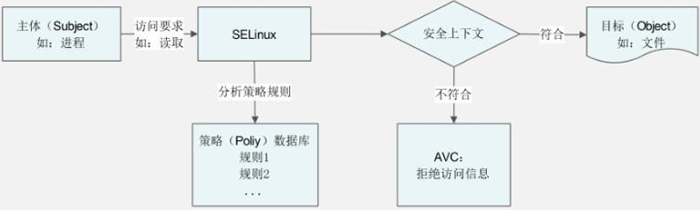
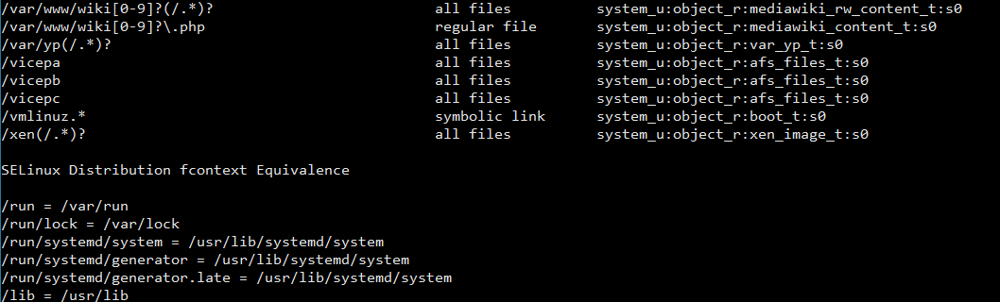

#### SELinux

- 简介

- 工作模式及配置文件

- 域和安全上下文查看

- 配置及默认安全上下文配置

- 策略规则及策略语言
  
  - 类型转换规则（决定进程启动之后的类型）

##### 简介

1. SELinux提供比传统linux文件权限管理更细哩度的权限控制。

2. 每个进程都运行在某个域中，同时每个文件都有自己的安全上下文类型，只有进程所在的域能够访问文件对应的安全上下文类型，才能进行读写操作。通过“域”的概念，SELinux 提供了进程沙箱的功能，最大限度控制进程所拥有的权限。



##### 工作模式及配置文件

SELinux 提供了 3 种工作模式：Disabled、Permissive 和 Enforcing，而每种模式都为 Linux 系统安全提供了不同的好处。

- Disable：SELinux 完全关闭

- Permissive：SELiunx 只进行检查，当安全策略规则应该拒绝访问时，访问仍然被允许。然而，此时会向日志文件发送一条消息，表示该访问应该被拒绝。

- Enforce：强制执行所有的安全策略规则。

除此之外，还有一个是SELinux 的策略规则组，Target、MLS和Minimum

- Target：一般SELinux 使用的策略组，给每个域提供沙箱环境

- MLS：在Target 的基础上再添加一层对数据机密级别的访问控制。管理员可以通过设置文件成 Unclassified，Confidential，Secret 和 Top Secret，不同机密级别的进程对不同级别的数据有不同的访问控制。

- Minimum：使用在内存较小的设备上

当前工作模式和策略组的可以通过命令 sestatus 进行查看。<br>

SELinux工作模式和策略组对应的配置文件是 /etc/selinux/config 

##### 域和安全上下文查看

查看进程的域和文件的安全上下文都是添加 ”-Z" 选项。比如查看进程的域就是 ps -Z，还有查看文件的安全上下文就是 “ls -Z”。<br>

域或者安全上下文的组成主要有四个字段，另外还有一个可选的类型字段，每个字段使用“：” 进行分隔。其中通常和访问控制相关的是第三个字段“类型“。

例子：

```bash
system_u：object_r：httpd_sys_content_t：s0：[类别]
#身份字段：角色：类型：灵敏度：[类别]
```

1. 身份字段：表示当前对象是被哪个身份的用户所拥有。常见的身份有，root，system_u，user_u 和 unconfined_u。所有的selinux 的身份类型可以通过 "seinfo -u" 进行查看。

2. 角色：通常用于表示是进程还是文件，system_r 指进程，object_r指文件。

3. 类型：这个字段主要用于访问权限的判断。进程对应一个域类型，文件对应一个域类型，当需要对文件进行读写操作时，SELinux会查找策略组，判断当前的进程域能否对该文件进行制定操作。

4. 灵敏度：灵敏度一般是用 s0、s1、s2 来命名的，数字代表灵敏度的分级。数值越大，代表灵敏度越高。

5. 类别：类别字段不是必须有的，所以我们使用 ls 和 ps 命令查询的时候并没有看到类别字段。但是我们可以通过 seinfo 命令来查询。

**SELinux相关的信息都能通过 seinfo 命令进行查询：**

- \-u： 列出SELinux中所有的身份（user）；  

- \-r： 列出SELinux中所有的角色（role）；  

- \-t： 列出SELinux中所有的类型（type）；  

- \-b： 列出所有的布尔值（也就是策略中的具体规则名称）；  

- \-x： 显示更多的信息配置及默认安全上下文配置

##### 配置及默认安全上下文配置

**文件的安全上下文**

文件的安全上下都可以通过 chcon 进行修改。chcon [选项] 文件或路径

选项：

- -R： 递归，当前目录和目录下的所有子文件同时设置；
- -t： 修改安全上下文的类型字段，最常用；
- -u： 修改安全上下文的身份字段；
- -r： 修改安全上下文的角色字段；


批量恢复或者修改安全上下文的命令： restorecon [选项] 文件或者目录。

选项：

- -R：递归.当前目录和目录下所有的子文件同时恢复；
- -V：把恢复过程显示到屏幕上；

restorecon 恢复安全上下文的依据是在semanage 中fcontext 中配置的规则。我们可以通过 “semanage fcontext -l” 进行查看。

semanage fcontext 对应的选项有：

- \-a：增加指定路径pattern 的安全上下文

- \-d：删除指定路径pattern 的安全上下文

- \-m：修改指定路径pattern 的安全上下文

- \-t：设定路径pattern 对应的安全上下文类型

semanage fcontext中是通过正则表达式来描述路径的，下图semanage fcontext 的例子：




**进程的安全上下文：**

进程的域类型较文件的域类型更加复杂，SELinux 有一套类型转换策略进行控制，使得父进程进行exec操作时按照指定的规则把新生成的进程赋值为对应的类型。


##### 策略规则及策略语言

**SELinux 策略规则的查看**：

- 查看所有SELinux 规则：seinfo \-b

- 查看某些具体的规则：sesearch [选项] [规则类型] [表达式]
  
  - 选项：
    
    - -h：显示帮助信息；
    
    - -s 主体类型：显示和指定主体的类型相关的规则（主体是访问的发起者，这个 s 是 source 的意思，也就是源类型）；
    - -t 目标类型：显示和指定目标的类型相关的规则（目标是被访问者，这个 t 是 target 的意思，也就是目标类型）；
    - -b 规则名：显示规则的具体内容（b 是 bool，也就是布尔值的意思，这里是指规则名）；
  - 规则类型：
    - --allow：显示允许的规则；
    - --neverallow：显示从不允许的规则；
    - --all：显示所有的规则；
  - 表达式：
    - -s 主体类型：显示和指定主体的类型相关的规则（主体是访问的发起者，这个 s 是 source 的意思，也就是源类型）；
    - -t 目标类型：显示和指定目标的类型相关的规则（目标是被访问者，这个 t 是 target 的意思，也就是目标类型）；
    - -b 规则名：显示规则的具体内容（b 是 bool，也就是布尔值的意思，这里是指规则名）；

**SELinux 策略语言**：

SELinux 的策略规则和类型转换都是通过SELinux 的策略语言进行描述。

[SELinux策略语言](https://blog.csdn.net/fybon/article/details/42263813)


