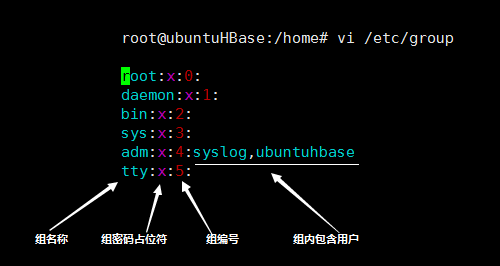
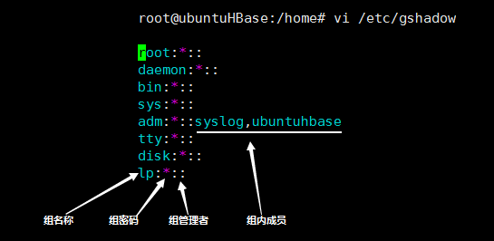
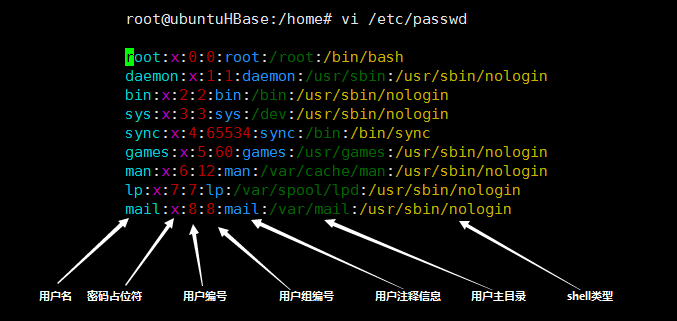
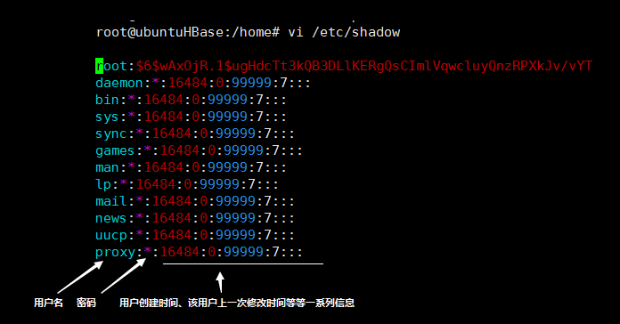

### 权限管理

linux 对每个文件和目录都有相应的权限标识，用于限定 owner，owner group 和 other 这三者对该文件所能进行的操作，以及该文件的 owner 和 owner group 是谁。<font color='red'>这个标识可以通过 “ll” 命令来查看。</font>

#### 文件目录权限管理

对文件目录权限的管理主要就是修改文件的权限修饰符和文件的 owner 和 owner group。<br>
权限管理主要需要用到几个命令: chmod、chown、chgrp，这三个命令分别就是对应 “修改修饰符”，“修改owner 或者 owner group”以及“修改 owner group”。

```bash
# chmod 中修改标识符的时候，分别用 u、g、o 和 a 表示不同范围的用户，分别代表 owner，owner group 和 全部用户
# chmod 中 = 代表赋权，+ 代表添加权限，- 代表移除权限
chmod [Option] <filename>

# chown 主要是修改文件对应的 owner 和 group
chown [Option] [username[:groupname]] <filename>

# chgrp 主要是单独修改文件的 group，这个是和 chown 最大的区别
chgrp [Option] <groupname> <filename>
```

##### 使用acl管理文件目录权限

要采用acl进行管理，首先要对对应的分区启动acl，此时需要编辑 /etc/fstab 文件中的 倒数第三列。

```bash
UUID=490ed737-f8cf-46a6-ac4b-b7735b79fc63 /                       ext4    defaults,acl        1 1
```

为了使更改生效，需要执行以下命令：

```bash
mount -o remount /
```

###### setfacl 设置权限

```bash
# 设置用户权限
setfacl -m u:<user name>:<priviledge> <file name>
# 设置用户组权限
setfacl -m g:<group name>:<priviledge> <file name>
```

参数介绍：

- -m： 设置acl权限

- -x：删除acl权限

- -b：删除所有权限

- -d：设置默认acl权限

- -k：删除默认acl权限

- -R：递归设置acl权限

###### getfacl 获取文件acl列表

#### 用户和用户组管理

用户和用户组管理主要会影响到用户对每个文件的访问权限，linux 通过结合用户和用户组以及文档权限修饰符的形式实现权限管理。

与用户添加，删除和修改相关的命令有，useradd、userdel 和 usermod。
与组添加，删除和修改相关的命令有，groupadd、groupdel 和 groupmod。

```bash
# useradd 中比较常用的选项有 d,g,G
# 其中 d 代表指定用户目录，g 代表所属用户组，G 代表所属附加用户组
useradd [Option] <username>
# usermod 的常用选项和 useradd 中的比较相似
usermod [Option] <username>

userdel <username>
```

##### 用户管理中的通用参数

- -c comment 给新用户添加备注  

- -d home_dir 为主目录指定一个名字（如果不想用登录名作为主目录名的话）  

- -e expire_date 用YYYYY-MM-DD格式指定一个账户过期的日期  

- -f inactive_days 指定这个帐户密码过期后多少天这个账户被禁用；0表示密码一过期就立即禁用，-1表示禁用这个功能  

- -g initial_group 指定用户登录组的GID或组名  

- -G group ... 指定用户除登录组之外所属的一个或多个附加组  

- -k 必须和-m一起使用，将/etc/skel目录的内容复制到用户的HOME目录  

- -m 创建用户的HOME目录（在 usermod 中采用到，用于修改home目录）

- -M 不创建用户的HOME目录（当默认设置里指定创建时，才用到） 

- -n 创建一个同用户登录名同名的新组  

- -r 创建系统账户  

- -p passwd 为用户账户指定默认密码  

- -s shell 指定默认登录shell  
  
  - 默认为： /bin/bash
  
  - /sbin/nologin : 表示该用户不能登录系统

- -u uid 为账户指定一个唯一的UID

#### 用户密码相关命令

linux 对用户密码的操作主要使用的 passwd 命令。

```bash
#直接调用 passwd 命令就是修改当前用户的用户名密码
passwd
passwd <username> #就是修改对应用户名的密码
```

#### 用户信息查看

- 查看用户组： groups \<user name\>

- 查看用户详细信息：finger \<user name\> （该命令需要安装）

#### 用户和用户组信息文件查看

用户和用户组的信息可以在以下的文件中查看得到：

1. /etc/group ：存储当前系统中的用户组信息
   
   
2. /etc/gshadow : 存储当前系统中用户组的密码信息
   
   
3. /ect/passwd : 存储当前系统中所有的用户信息
   
   
4. /ect/shadow : 存储当前系统中所有用户的密码信息
   
   
