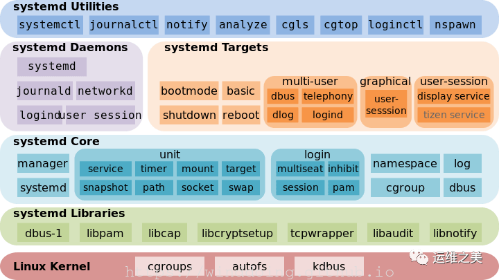

### 自启动脚本与自定义服务

本质上配置自启动脚本就是相当于把某个程序配置成服务，然后系统可以在启动时调用服务启动的接口启动该程序。有两种配置服务的方式，一种是在`/etc/init.d`中放置服务的配置文件，另一种是放在`/lib/systemd/system/` 并使用`systemctl`命令管理。**区别是，`/etc/init.d`中程序启动脚本必须是调用后会退出的，而`/lib/systemd/system`中定义的启动命令是不能后台执行的。**

#### 使用chkconfig配置开机脚本

1. 将脚本移动到/etc/rc.d/init.d目录下。原因是 chkconfig  是通过文件名来添加开机脚本，并且只会识别 /etc/rc.d/init.d 目录下的脚本

```bash
vim /etc/rc.d/init.d/autostart.sh
```

2. 增加脚本的可执行权限

```bash
chmod +x  /etc/rc.d/init.d/autostart.sh
```

3. 添加脚本到开机自动启动项目中

```bash
cd /etc/rc.d/init.d
chkconfig --add autostart.sh
# chkconfig --level <run level numbers> <script name> on
```

##### 启动脚本格式

启动脚本的格式必须符合 shell 的格式，即必须以 #!/bin/bash 开头，以下是启动脚本的模板

```bash
#!/bin/bash
#
#chkconfig: 234 85 15
#description: execute autostart script
#
SCRIPT_NAME=`basename "$0"`

case $1 in
start)
<script for start the service>
touch /var/lock/subsys/$SCRIPT_NAME # 必须在/var/lock/subsys 中touch和script相同名字的文件，才能在关机时被调用
;;
stop)
<script for stop the service>
if [ -f /var/lock/subsys/$SCRIPT_NAME ]; then
    rm /var/lock/subsys/$SCRIPT_NAME
fi
;;
restart)
<script for restart the service>
;;
*)
echo "Usage:$0(start|stop)"
;;
esac
```

模板中的chkconfig 对应的三个数字分别是 runlevel，启动优先级和关闭优先级。用于在使用 chkconfig

 -add 添加启动脚本时自动配置 runlevel 和运行优先级。<br>

**run level 注意点:**<br>

如果同时配置了 level 4 和 5，并且设置为图形界面启动（即会启动到 level 5），这对应的脚本会执行 2次。<br>

**系统开机执行和关机执行，会传入action参数，如start 或者stop。同时，把脚本放到/etc/init.d后，就可以使用 `service <script name> (start|stop|restart|status)`去启动或者检查服务的状态。**

#### chkconfig的其他参数

- --del ：删除对应的脚本的开机启动

- --level：设置run leve，

#### 配置service文件

###### systemd背景

`Systemd`（系统管理守护进程）的主要目的就是减少系统引导时间和计算开销。<br>

Systemd 的核心是一个叫单元 `unit` 的概念，它是一些存有关于`服务service`（在运行在后台的程序）、`设备`、`挂载点`、和操作系统其他方面信息的配置文件。Systemd 的其中一个目标就是简化这些事物之间的相互作用，因此如果你有程序需要在某个挂载点被创建或某个设备被接入后开始运行，Systemd 可以让这一切正常运作起来变得相当容易。



Systemd 中的所有操作都是通过 `systemctl` 交互控制

| 命令                                      | 功能          |
| --------------------------------------- | ----------- |
| systemctl list-unit-files               | 列出系统上的所有单元  |
| systemctl list-unit-files –type=service | 限制输出列表只包含服务 |
| systemctl status ssh.service            | 查看服务的状态     |
| systemctl stop ssh.service              | 停止服务        |
| systemctl start ssh.service             | 开启服务        |
| systemctl enable ssh.service            | 设置开机自启      |
| systemctl disable ssh.service           | 禁止开机自启      |

Systemd 可以管理所有系统资源，不同的资源统称为 Unit（单位）。<br>

在 Systemd 的生态圈中，Unit 文件统一了过去各种不同系统资源配置格式，例如服务的启/停、定时任务、设备自动挂载、网络配置、虚拟内存配置等。而 Systemd 通过不同的文件后缀来区分这些配置文件。<br>

Systemd 支持的 12 种 Unit 文件类型

- .automount：用于控制自动挂载文件系统，相当于 SysV-init 的 autofs 服务
- .device：对于 /dev 目录下的设备，主要用于定义设备之间的依赖关系
- .mount：定义系统结构层次中的一个挂载点，可以替代过去的 /etc/fstab 配置文件
- .path：用于监控指定目录或文件的变化，并触发其它 Unit 运行
- .scope：这种 Unit 文件不是用户创建的，而是 Systemd 运行时产生的，描述一些系统服务的分组信息
- .service：封装守护进程的启动、停止、重启和重载操作，是最常见的一种 Unit 文件
- .slice：用于表示一个 CGroup 的树，通常用户不会自己创建这样的 Unit 文件
- .snapshot：用于表示一个由 systemctl snapshot 命令创建的 Systemd Units 运行状态快照
- .socket：监控来自于系统或网络的数据消息，用于实现基于数据自动触发服务启动
- .swap：定义一个用户做虚拟内存的交换分区
- .target：用于对 Unit 文件进行逻辑分组，引导其它 Unit 的执行。它替代了 SysV-init 运行级别的作用，并提供更灵活的基于特定设备事件的启动方式
- .timer：用于配置在特定时间触发的任务，替代了 Crontab 的功能

###### service 文件配置项

###### 参考链接：

- [systemd原理与使用 | Winddoing's Notes](https://winddoing.github.io/post/14807.html "systemd原理与使用")

- [可能是史上最全面易懂的 Systemd 服务管理教程！( 强烈建议收藏 ) - 云+社区 - 腾讯云](https://cloud.tencent.com/developer/article/1516125)
