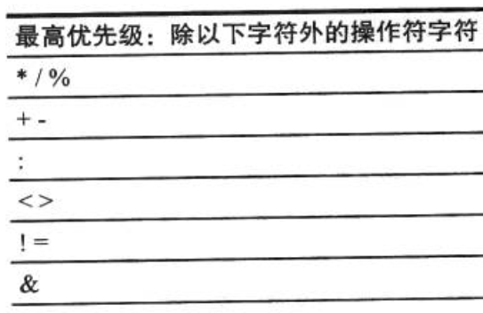

### 数据类型与表达式

- 基本数据类型
  
  - Option 类型
  
  - 运算符

- 流程结构
  
  - if结构
  
  - 循环结构
  
  - try catch 结构

- 操作符
  
  - apply 和 update 方法
  
  - unapply方法(提取器模式)
  
  - unapplySeq 方法

#### 基本数据类型

**scala 中，一切皆对象，包括基本类型。**

基本类型的运算在scala中被包装成方法，所有的表达式最终都会解析成语法树，然后转变成不断的方法调用。

```scala
//在scala 中，下面的表达式等价于 1.+(2)
1 + 2

//在scala 基本类型也能进行方法调用。
1.getClass()
1.getClass  // scala 中没有参数可以直接省略括号
```

##### Option 类

在scala中的 Option 类就相当于 Java 中的 Optional，这个类有两个case class，一个是Some 表示有指定类型的对象，None 表示没有指定类型的对象。这用设计模式用于避免使用Null，导致NullPointException。

```scala
def parseName(name:String):Option[(String,String)]={
    if (arg.contains(" ")){
      val strArr = arg.split(" ")
      return Some(strArr(0),strArr(1))
    }else{
      return None
    }
}
```

##### 运算符

运算符基本与 java 相同

- 数学计算符：+，-，\*，/，%

- 比较算符：<, >, != , == , >= , <=

- 逻辑算符：&&，||， !

- 位运算符：&，|， ^（异或）

##### 流程结构

###### if结构

基本和java相同，但是多了 if 表达式。当省略else 时默认条件不符合返回 () .

```scala
var a = if (1==2) 1 else 0 
// a = 0
```

###### 循环结构

scala 提供 while，do-while 和 for 循环。for 循环中对应 java 的 for in 模式如下。并且增加了守卫的功能和多层循环功能。

```scala
for (a <- b) { // b is an iterable object
 println(a)
}

// 增加的守卫功能
for (a <- b if a > 10) {
 println(a)
}

// 多层循环，其中 a 为外层循环，b为内层循环
for (a <- 1 to 10; b <- 1 to 5) {
    // do something
}
```

###### 异常捕捉

scala 中的异常捕捉语法整体结构和 java 相同，主要的却别在 catch 部分。catch 部分采用的是 scala 的模式匹配语法。详细请看 

```scala
try{
    ...
}catch {
    case ex: NullPointException => 
    case ...
}finally{
    ...
}
```

#### 操作符

scala 所有的操作符都会被解析成方法调用，解析的原则如下

- 没有参数的方法，可以使用 \<object name\> \<method name\> 调用。**如果方法的名称是 unary\_ 开头的，则采用\<method name\> \<object name\>，例如负号。**

- 有一个参数的方法可以变成二元操作符进行调用。

- 算符的优先级如下：**（此外，直接进行方法调用的优先级高于所有操作符）**
  
  

- 结合性：scala中除了以冒号（：）结尾的操作符，其他都是左结合性。

###### apply 和 update 方法

每个类或者对象都可以定义apply 方法，定义了apply 方法之后相当于这个对象就可以被当做函数去调用。

```scala
class Person(var name:String){
    def apply(something:String)={
        println(name + " Say: " + something)
    }
}

new Person("abc")("def")
// abc Say: def
```

scala update 方法主要用于集合的设计中。scala 会把等号右侧的参数作为方法的最后一个参数传入，剩下的参数通过括号传入。

```scala
class TestClass {
    def update(arg1:Int,arg2:Int,value:Int)
}

obj(1,2) = 3
```

##### unapply方法(提取器模式)

在scala中所谓提取器就是一个带有 unapply 方法的对象，用于从输入参数中提取出所需的内容。下面的例子就是使用了提取器。**但是提取器更常见的是使用在模式匹配中，比如下面的例子就相当于定义了一个叫做Name 的模式。**

```scala
object Name {
    def unapply(name:String):Option[(String,String)]={
        if (arg.contains(" ")){
             val strArr = arg.split(" ")
             return Some(strArr(0),strArr(1))
         }else{
             return None
         }
    }
}
var Name(a,b) = "Spark Liang"
println(a) // Spark
println(b) // Liang

def isName(str:String)=Boolean{
    str match {
        case Name(_,_) => true
        case _ => false
    }    
}
```

##### unapplySeq 方法

在scala中可以通过定义unapplySeq提取出Seq，**需要注意的是，当一个对象同时定义了 unapply 和unapplySeq 的方法，则只会把unapply 当做提取器方法**
