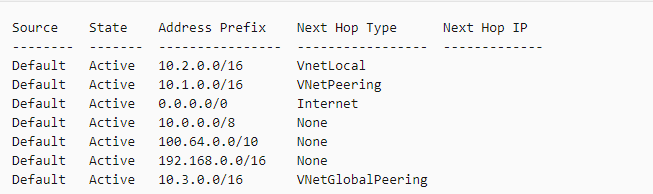

#### VNet

- VNet and Subnet

- IP 地址

- DNS 服务

- 路由和点对点连接

- 网络安全组

- 网关

- 网络监视器（network watcher）

##### VNet and Subnet

一个VNet实例相当于一个总的路由器，，在这个路由器上面可以进行各项配置，而各个subnet相当于是一个路由网络流量的子路由器，只用于按照IP分发流量。在VNet实例上可以配置：

- 子网段

- 防火墙

- 网络安全组

- DNS 服务器

- 网络配对

- 服务终结点

##### IP地址

在分配内网地址时可以选择DHCP或者静态IP。分配公网IP可以选择绑定现有公网IP或者新创建IP。

##### DNS服务

Azure 提供默认的DNS 解析和自定义DNS 服务器解析。<br>

对于VM，azure 默认 DNS 会为每个VM创建一个DNS名称。**\<VM name\>.internal.cloudapp.net**。但该DNS名称只在同一个VNet中有效。

##### 路由和点对点连接

**点对点连接**

- 当配置两个VNet 之间的点对点连接之后，两个VNet 即可互通，但是DNS依旧默认不共享，即无法通过 \<VM name\>.internal.cloudapp.net 访问到对应的 VM。

- 点对点连接只能访问到建立连接的VNet，不能直接访问间接配对的连接。比如 A <--> B，B <--> C，A是无法直接访问到C的 。原因是 A VNet 没有指向 C VNet 的路由。<br>
  
  ```bash
  az network nic show-effective-route-table \
      --resource-group <resource group name> \

      --name <NIC name> \

      --output table
  ```
  
  

- 


##### 网关

##### 网络监视器

使用网络监视器可以监控不同VM之间的网络通信流量。但是需要首先在VM上安装对应的agent 拓展

[https://learning.oreilly.com/videos/microsoft-az-300-certification/1018947654/1018947654-AZZ300_66](https://learning.oreilly.com/videos/microsoft-az-300-certification/1018947654/1018947654-AZZ300_66)
