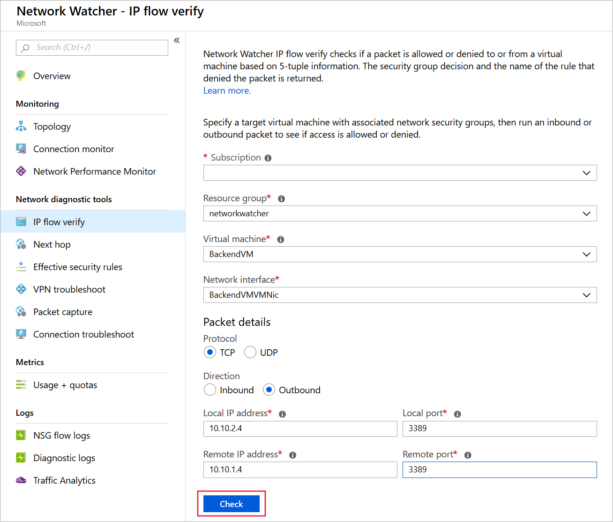

#### VNet检查和监控工具

- Network Watcher Monitoring Tools
  
  - Topology
  
  - Connection Monitor
  
  - Network Performance Monitor

- Network Watcher diagnostic tools
  
  - IP flow verify
  
  - Next hop
  
  - Security group view
  
  - Packet capture
  
  - Connection troubleshoot
  
  - VPN troubleshoot

- Metrics
  
  - Usage and quotas
  
  - Logs

##### Network Watcher Monitoring Tools

###### Topology

这是用于查看某个VNet 的拓扑结构

###### Connection Monitor

这个工具用于监控不同资源之间的网络连接，用于监控性能和延迟，检查是否存在Azure上网络发生修改导致的网络中断。

###### Network Performance Monitor tool

这个工具用于监控不同网络之间的连接性能。包括：

- 支路和数据中心之间的性能

- VNet 之间的连接性能

- 本地网络和Azure网络之间

- Azure ExpressRoute 的性能

##### Network Watcher diagnostic tools

###### IP flow verify

用于进行**链路端口级别**的连接性检查，检查从指定source到指定 vm 的端口的连通性。

配置页面如下：

###### Next hop

用于检查指定 VM 的下一个路由，检查是否因为错误配置路由导致无法连通

###### Security group view

当出现无法连通VM时，该工具会显示相关的 NSG 规则，从而判断是否有 NSG 规则配置错误

###### Packet capture

###### Connection troubleshoot

检查ip 或者 域名的连通性，并且检查对应的延迟。如果连接失败，该工具会给出以下方面的原因：

- CPU 占用过高

- Memory 占用过高

- 客户端防火墙阻断了连接

- DNS 解析错误

- NSG 规则错误

- 自定义路由表配置错误

###### VPN troubleshoot

检查VPN的连接性
