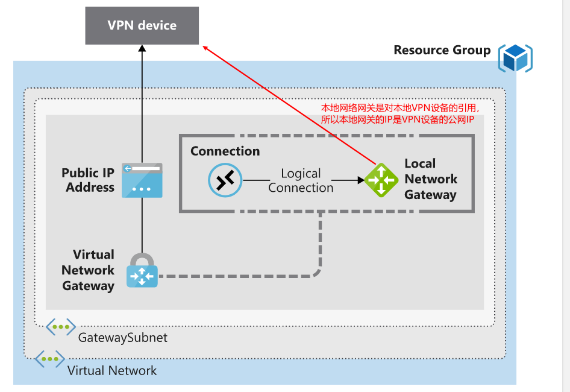

#### 连接本地和Azure网络

- 站点到站点 VPN
  
  - 先决条件
  
  - 网络拓扑图
  
  - 搭建步骤

- ExpressRoute

- 优缺点对比

##### 站点到站点VPN

###### 先决条件

- 本地VPN设备，并且具有公网IP

- 需要搭建VPN 的 VNet 要具有名为 GatewaySubnet 的子网。

###### 网络拓扑图

VNet通过使用本地网关对本地的VPN设备进行引用，通过建立connection后转发流量。

###### 搭建步骤

1. [创建 VNet 的 VPN 所需的公网IP](https://docs.microsoft.com/zh-cn/azure/virtual-network/virtual-network-public-ip-address)

2. 为对应的VNet创建VPN网关

3. 为对应的VNet创建本地网关（local-gateway），并且绑定本地VPN设备的公网IP

4. 等待VPN的状态是创建完成之后，创建 VPN 到本地网关（local-gateway）的connection

##### ExpressRoute

ExpressRoute是microsoft 提供的网络专线服务。主要用于搭建直通Azure 云的网络专线。 

###### 优点：

- 私有专线。数据上云过程中不需要通过公网，

- 延迟低，带宽高。由于是专线，相对于VPN降低了数据加密的损耗。

- 高可用。私有专线会有多个物理线缆热备。

##### 优缺点对比

| Connection                     | Azure services supported                                    | Bandwidth                                                | Protocols      | Typical use case                                                                        |
| ------------------------------ | ----------------------------------------------------------- | -------------------------------------------------------- | -------------- | --------------------------------------------------------------------------------------- |
| Virtual network, point-to-site | Azure IaaS services, Azure Virtual Machines                 | Based on the gateway SKU                                 | Active/passive | Dev, test, and lab environments for cloud services and virtual machines.                |
| Virtual network, site-to-site  | Azure IaaS services, Azure Virtual Machines                 | Typically < 1 Gbps aggregate                             | Active/passive | Dev, test, and lab environments. Small-scale production workloads and virtual machines. |
| ExpressRoute                   | Azure IaaS and PaaS services, Microsoft Office 365 services | 50 Mbps up to 10 Gbps (100 Gbps for ExpressRoute Direct) | Active/active  | Enterprise-class and mission-critical workloads. Big data solutions.                    |
