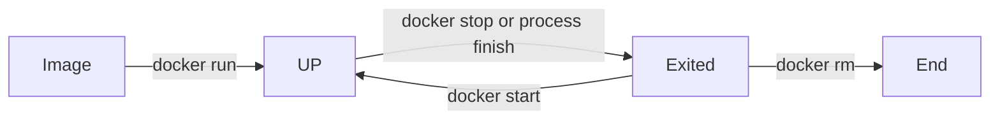

### 容器管理

- 容器概念
  
  - 容器生命周期

- 容器运行选项
  
  - 数据卷相关
  
  - 网络相关

- 容器导入导出

- 容器常用命令

#### 容器概念

##### 容器生命周期



**docker容器很重要的性质就是容器的生命周期和容器运行的主进程的生命周期是一致的，所以docker容器运行的命令结束了，容器就会进入 Exited 的状态。所以需要运行后台程序的话，需要程序在容器内以前台的方式运行，但是配置容器在宿主机以后台形式运行。**

###### 前后台运行

默认情况下使用docker run 的命令就是让容器在前台运行。如果需要使用后台运行模式需要加上 -d 的参数。**加上-d之后，容器中的 STDOUT 的内容可以通过 docker log查看。**

```bash
docker run -d ubuntu /bin/sh -c "while true; do ech

o hello world; sleep 1; done"
```

如果需要使用终端个容器进行交互的话，需要添加 -i 和 -t 参数。并且需要运行 bash 命令

```bash
docker run -it ubuntu bash
```

由于在执行exit命令后shell 的生命周期就结束，所以容器就会停止，如果需要重新连接则需要调用 start 和 attach命令，或者直接调用 start -a.

```bash
docker start -a <container ID or container name>
# 如果需要同时多个连接到终端，则需要使用nsenter，否则两个终端是同步的。
nsenter --target $PID --mount --uts --ipc --net --pid
```

如果执行运行一个容器并且在程序结束时自动删除容器，则可以使用 --rm 参数。

```bash
docker run --rm <image name>:<tag> 
```

#### 容器运行选项

- --name：设置容器的名字

- --hostname：设置容器的hostname

##### 数据卷相关

- -v ：\[host path\]:container path:\[rw or ro\]
  
  - 用于在容器内对应目录创建**不被持久化保存到镜像的数据卷**。当省略host path时即创建的是匿名卷。默认的数据卷是可读写的，除非显式指定为 ro。

- --volumes-from：\<container name or id\>
  
  - 把某一个容器中的数据卷挂载到该容器中。**数据卷源容器不需要处于运行状态，这点如容器互联完全不同。**
  
  - 例子：容器A中挂载了 /data 数据卷，容器B --volumes-from A，则B的 /data 就等同于 A 的 /data。但是B对其他目录的读写，依旧独立于 A。

##### 网络相关

- -p：\[\<listen IP\>\]:\<host port\>:\<container port\>
  
  - 一般用于对宿主机的端口映射。
  
  - 查看端口映射情况，可以通过命令： docker port \<container name\>

- --link：\<container name\>:\<alias\> 
  
  - 用于实现容器间的互联。互联是指可以通过 container name 直接可以得到对应 container 的IP。
  
  - **实现互联的两个container 都必须处于运行中的状态。**
  
  - link的实现原理是，docker把/etc/hosts和/etc/resolv.conf 这个文件处理成动态文件，可以把互联的container 的 name 和 IP放入该文件中。

- --net：用于配置容器的桥接模式。可选 bridge，none，container:\<container name\>，host
  
  - none，指启动时不配置，在容器中再进行配置。
  
  - container，指于某个container共用一个网络。、
  
  - host：直接使用 host 的网络。

#### 容器导入导出

#### 容器常用命令

- 删除所有已退出的容器
  
  ```bash
  docker rm $(docker ps -qf status=exited)
  ```

- 
