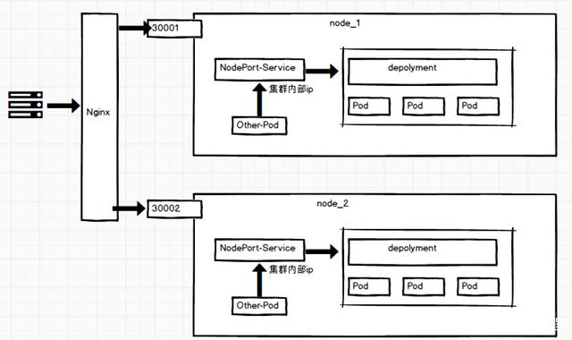

### Service和Ingress

- Service类型及作用

- 配置

#### Service类型及作用

service用于给集群内部或者外部提供固定的DNS名称用于访问服务，并且提供负载均衡的功能。

Service的有4种类型，不同类型对应着不同的服务暴露级别：

- ClusterIP：只将服务通过clusterIP暴露给集群内部的其他Pod使用。
  
  

- NodePort：将服务的端口绑定到所有Node的指定端口上，即集群外部可以通过Node上的端口访问服务。
  
  
  
  

- LoadBalancer：借助外部的负载均衡器，提供统一的入口将请求发送到NodePort上。
  
  

- 
