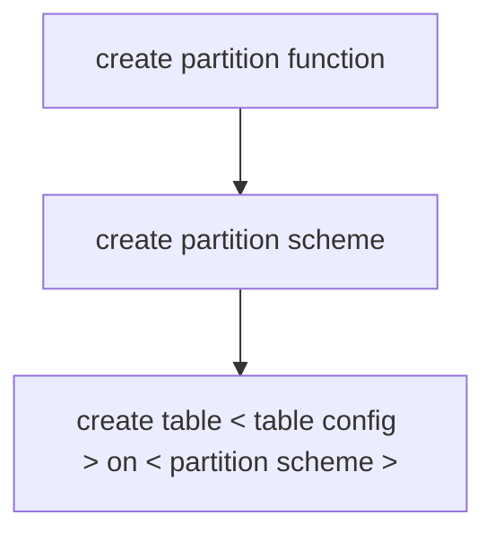

##### 分区表创建

总体过程如下：



```sql
-- create partition function
create partition function <function name>(<column type>)
as range [left|right] -- boundary belong to left range or right range
for values (<boundary values>);

-- create partition shceme
create partition scheme <partition scheme name>
as partition <partition function name>
[all] to (<file group name>) -- for SQL DB can be only [primary] filegroup

-- create a table with partition
create table <table name>(
    <fields configuration>
)on <partition scheme name>(<partition column name>)
```

##### 分区分割和合并

每次分割之前都需要通过 alter partition scheme 制定新分区所属的文件组。

```sql
-- config the file group to store the new partition
alter partition scheme <partition scheme name> next used <file group name>

-- split partition
alter partition function <partition function name>() split range (<split boundary>);
-- 注意语句钟的括号

-- merge a partiton
alter partition function <partition function name>() merge range (<boundary to merged>);
```

###### 分区表的最佳实践：

- 在分区表实际使用的分区两端保留两个空白分区，保证在分割和合并分区时导致多余的文件读写。

##### 分区交换

分区交换的总体过程如下：

1. 根据源表结构创建空的分区交换表

2. 使用分区交换的命令把源表的某个分区和新创建的空表交换分区。

```sql
-- create a empty table with sample table structure
select * into <new table name> from <source table name> where 1=2

-- use the command to switch the partition
alter table <source table> switch partition <partition id> to <new empty table> [partition <partition id>]
-- use the command to switch the partion to a unpartition table 
alter table <source table> switch partition <partition id> to <new empty table>
```

##### 查看分区信息

```sql
select 

    s.name as schema_name
    ,t.name as table_name
    ,convert(varchar(50), ps.name ) as partition_scheme
    ,p.partition_number
    ,convert(varchar(10), ds2.name ) as filegroup
    ,convert(varchar(19), isnull(v.value, ''), 120) as range_boundary
    ,str(p.rows, 9) as rows
from sys.indexes i
left join sys.tables t on
    i.object_id = t.object_id
left join sys.schemas s on
    t.schema_id = s.schema_id
join sys.partition_schemes ps on 
    i.data_space_id = ps.data_space_id
join sys.destination_data_spaces dds on 
    ps.data_space_id = dds.partition_scheme_id
join sys.data_spaces ds2 on 
    dds.data_space_id = ds2.data_space_id
join sys.partitions p on 
    dds.destination_id = p.partition_number
    and p.object_id = i.object_id 
    and p.index_id = i.index_id
join sys.partition_functions pf on 
    ps.function_id = pf.function_id
LEFT JOIN sys.Partition_Range_values v on 
    pf.function_id = v.function_id
    and v.boundary_id = p.partition_number - pf.boundary_value_on_right
--WHERE i.object_id = object_id('wfpuser_t0305logs')--分区表名
where i.index_id in (0, 1)
order by schema_name,table_name,partition_number
```
