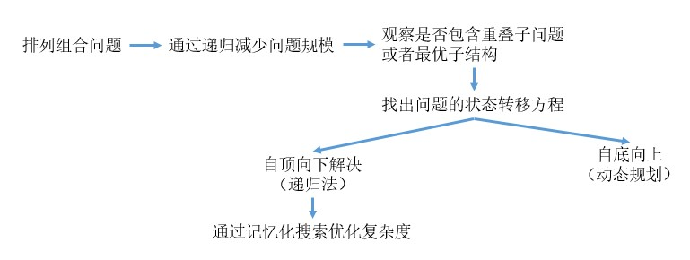

#### 动态规划

- 基本思路
  
  - 找出状态转移方程

- 常见例题
  
  - 

- 经典问题

##### 基本思路

动态规划的基本思路如下:

其中第一和第二步是判断是否能够使用动态规划。判断使用动态规划方法后，最重要的是找出状态转移方程，即下一层的问题是如何从上一层的问题组合而成。

###### 找出状态转移方程

例子：

对于爬楼梯问题，其状态方程如下

$f(n) = f(n-1) + f(n-2)$

其中 f 是指第n层可能的爬法。方程意思是，第 N 层的爬法是第 n-1 层爬法加上第 n-2 层的爬法。因为第n层可以从第 n-1 层爬一级到达，也可以从第 n-2 层爬两级到达。

再如 0-1 背包问题，其状态方程如下：

$f(n,c) = max \{ f(i-1,c), v(i) + f(i-1,c - w(i))\}$

其中 f 是指在考虑前n个物品，并且背包容量有c时，能够容纳的物品的最大总价值。$v(i)$ 是指第i个物品的价值。$w(i)$ 是指第i个物品占用的空间。 

方程的意思是，当只考虑前n件物品时装入容量为c的背包时，这是最优解可能存在两种情况:

- 第一种是不放入背包中，这时背包价值和只考虑前 n-1 个物品时的背包的最优解相同。

- 第二种是第n个物品放入背包，由于需要把物品放入背包，所以需要保证物品放入背包前需要有$w(i)$的空间。所以考虑放入背包时，价值等于该物品的价值加上考虑 n-1 的物品，在容量只有$c-w(i)$ 的背包时的最优解，即$v(i) + f(i-1,c-w(i))$

##### 常见例题

###### 爬楼梯（Climbing stairs）

有一个楼梯，总共有n阶台阶。每一次，可以上一个台阶，也可以上两个台阶。问，爬这样的一个楼梯，一共有多少不同的方法？

###### 0-1背包问题

给定背包容量W，一系列物品{weiht,value}，每个物品只能取一件，获取最大值

变体：

- 多重背包问题
  
  - 变化点：每个物体可以装入不止一次，为有限次
  
  - 与0-1背包问题的联系：可以把每个物品没放入一次视为一个独立的物品，此时转化为0-1背包问题。

- 完全背包问题
  
  - 变化点：每个物体可以装入不止一次，为有无限次
  
  - 与0-1背包问题的联系：可以把每个物品没放入一次视为一个独立的物品，此时转化为0-1背包问题。并且由于背包容量有限，所以每种物品最多放入册数量是背包的容量除以物品的空间。

##### 经典问题
