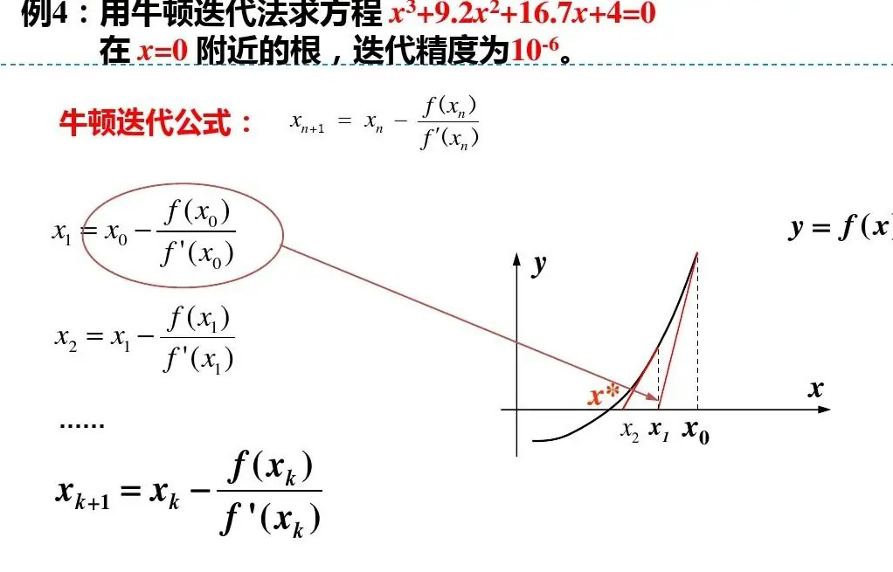

#### 常用数学算法

- 素数相关
  
  - 公约数公倍数计算
  
  - 合数分解

- 数值分析算法
  
  - 牛顿迭代法
  
  - SHA256

##### 素数相关

###### 公约数公倍数计算

辗转相除：

```python
def gcd(a, b):
    """Return greatest common divisor using Euclid's Algorithm."""
    while b:
        a, b = b, a % b
    return a
def lcm(a, b):
    """Return lowest common multiple."""
    return a * b // gcd(a, b)
```

###### 合数分解

算法步骤：

1. 判断是否为素数

2. 有小到大尝试各个素数看是否可被乘除，若能则结果添加该素数

##### 数值分析算法

###### 牛顿迭代法

概念图：



**求三次方根实例代码：**

```python
def f(x):
    return (x-3)**3        '''定义 f(x) = (x-3)^3'''

def fd(x):
    return 3*((x-3)**2)    '''定义 f'(x) = 3*((x-3)^2）'''

def newtonMethod(n,assum):
    time = n
    x = assum
    Next = 0
    A = f(x)
    B = fd(x)
    print('A = ' + str(A) + ',B = ' + str(B) + ',time = ' + str(time))
    if f(x) == 0.0:
        return time,x
    else:
        Next = x - A/B
        print('Next x = '+ str(Next))
    if abs(A - f(Next)) < 1e-6: 
        print('Meet f(x) = 0,x = ' + str(Next)) '''设置迭代跳出条件，同时输出满足f(x) = 0的x值'''
    else:
        return newtonMethod(n+1,Next)

newtonMethod(0,4.0)    '''设置从0开始计数，x0 = 4.0'''
```
