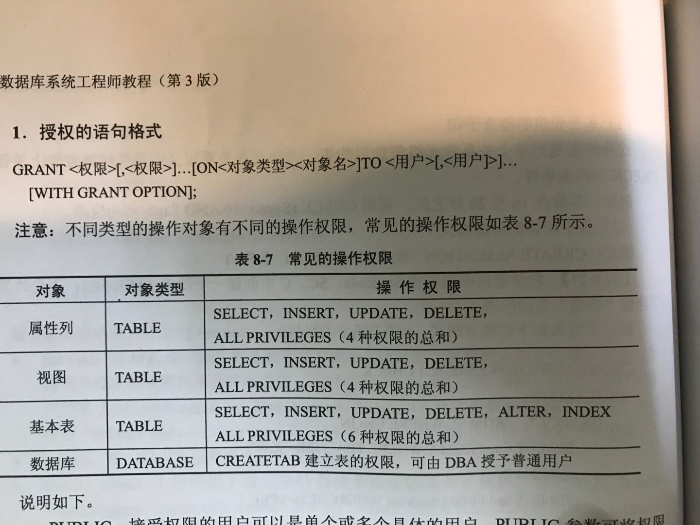

### 视图

#### 语法

```sql
create view "view name"("col name 1","col name 2") as
select ...
[with check option]
-- 该选项是保证 insert，update 或者 delete 依旧满足 where 的条件。
-- 比如在where age > 18 的view 里面，不允许 update 成 age =17

drop view "view name"
```

#### 限制条件

只允许对只是进行简单select where 得到的视图进行更新，如果包含 join 或者 group by 的视图都不能进行 “增删改” 。

#### 概念

视图属于三层结构中的外模式。
又称为“虚表”

### 表

#### 语法:

```sql
# 创建表
create table <tbl name>(
    <field name> <data type> <constraint name>,
    <tbl level constraint>
)
# 主键的列级约束
<field name> <data type> primary key
# 主键的表级约束,采用表级约束可以定义复合主键
primary key(<field name>)
# 外键的列级约束
# <field name> <data type> reference <tbl name>(<field name>)
# 外键的表级约束,采用表级约束可以定义复合主键
foreign key(<field name>) reference <tbl name>(<target field name>)


# 修改表
alter table <tbl name>
    add <col name> <data type> <constraint name>
    modify <col name> <data type>
    drop column <col name>
#删除表

drop table <tbl name>
```

### 索引

#### 语法

```sql
create [unique][cluster] index <idx name> on <tbl name>(<col name>)
```

#### 索引与性能

查询性能的主要瓶颈是I/O操作。若查询条件涉及的数据分散分布在多个I/O块中，要比相对集中于少量几个I/O块中的查询效率明显低很多。

### Select

#### 结构

```sql
select ... from ...
where
group by
having -- 需要注意的是此处的 having 不能使用 select 中的字段
order by
```

#### 不常见的语法

with子句

```sql
with <view name>[(col1,col2)] as
    select ...
select
from <tbl name> or <view name>
# 需要注意的是，可以在一条sql中使用多个 view
```

字符串比较

```sql
% # 表示多个字符
_ # 表示单个字符
```

谓词 ANY 和 ALL<br>
ANY表示一组值中的任意一个值，ALL 表示一组值中的所有值<br>
集合操作<br>
union，intersect，except<br>

### 约束

#### 字段级约束

not null, unique , primary key, check

#### 表级约束

primary key(col1,col2), foreign key col reference tbl(col2)

#### 全局约束

```sql
create assertion <name> check(
    # 条件语句，可以包含子查询
    # 例
    not exists(
        select * from tbl where age = 18
    )
)
```

### 权限管理

#### 授权


with grant option 是指被授权的对象能够授权其他人拥有对应的权限
撤销

```sql
revoke [privilege] on [obj type][obj name] from <user name> [restrict|cascade]
```

restrict 表示只撤销对应用户的，cascade 是级联撤销由该用户授权的其他用户。

#### 概念

在数据库中用户可以通过对象的所有者、拥有授予相关权限的权限的用户或者DBA执行GRANT语句获取对应的权限。

### 触发器

#### 语法

```sql
# 创建
create trigger <name> [before|after] [delete|insert|update] [of col1,col2]
on <tbl name>
[for each row] # 默认是 for each statement, 指一个语句只会触发一次。
[referencing new as <name>|old as <name>|new row as <name>|old row as <name>]
when <condition>
begin
    ...
end
# 修改
使用alter trigger 重新定义触发器
```

### 嵌入式sql

```sql
# PL/1 或者 C语言
exec sql <statement>;
# cobol
exec sql <statement> end-exec
```

#### 使用变量

```sql
# 定义变量
exec sql begin declare section;
    # 例
    char Mson[3],Mcno[3];
    int Mgarde
exec sql end declare section;
# 使用变量, 使用 : 加上变量命来读取变量值
:Mson

使用游标
# 定义游标
exec sql declare cursor <name> for
    select ...
end_exec
# 打开游标
exec sql open <name> end_exec
# 读取数据并推进游标
exec sql fetch from <name> into <variable name1>,<variable name2> end_exec
# 关闭游标
exec sql close cursor <name> end_exec
```

### 函数

```sql
create function <name> (var1 <type>,var2 <type>)
    returns <type>
    begin
        declare <var name> <type>;
        ...
        return <var name>;
    end
```

### 其他

数据设计中，通过视图对外暴露查询，通过存储过程对外提供数据修改的接口。
