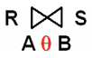

### 概念：
- 属性：
- 域：属性的取值范围。所有域所包含的都应是原子数据。
- “目” 或 “度”：属性的个数
- 候选码：能够唯一标识元组的属性。（相当于 unique key）
- 主码：（主键）
- 主属性：任何候选码都是主属性
- 外码：外键
- 全码：所有属性都是候选码。

#### 关系的类型：
- 基本关系
- 查询表
- 视图

#### 完整性约束：
- 实体完整性：主键不能为 null
- 参照完整性：外键必须在相关联的主键中有相应的取值，或者取 null
- 用户自定义完整性：用户自定义约束

### 关系代数运算
#### 基本关系运算：
- 并：R ∪ S
- 差：R-S
- 笛卡尔积：X
- 投影：π
- 选择：σ
*并和差要求关系具有相同的结构。*
#### 扩展关系运算：
- 交：∩ （要求关系具有相同结构）
- 连接
  - θ连接：其中 θ 指连接条件 
  - 等值连接： 相当于 θ 为 “=”
  - 自然连接：使用同名属性进行等值连接，并且去掉重复属性列。
  - 除法：被除关系去掉共有属性后，剩下的每个元组的像集完全包含“除数关系”的元组即为结果集。
  - 广义投影：允许投影列表使用运算表达式
  - 外连接
  - 聚合函数
*θ连接 和 等值连接 需要注意同名属性需要带上关系名作为前缀。*

### 数据库范式：
这里的码是指候选码，一般出现低范式的原因都是一个关系中存在多个候选码。
- 第一范式：所有值域都只包含原子数据。
- 第二范式：所有非主属性完全依赖码，即消除了部分函数依赖。
- 第三范式：消除了非主属性对码的传递依赖。
- BCNF：满足3NF，消除主属性对候选键的传递依赖
- 4NF:消除多值依赖。
#### 函数依赖：

Y 函数依赖于 X ： 表示为 X → Y。即表示每个 X 只能推出一个 Y （Y 可以相同）。 
部分函数依赖：AB能够推出C，A单独也能推出C，B单独也能推出C。 
完全函数依赖：AB能够推出C，A单独不能推出C，B单独不能推出C。 
依赖传递：X → Y，Y → Z，则 X → Z属于依赖传递。 
多值依赖: 关系R对应的属性集U，U包含 XYZ 三个部分，每个(X,Y)组合都对应着一组 Z 值，这组 Z 的值只与 X 有关，称为 Z 多值依赖于 X，X→→Z。 
冗余的函数依赖：在函数依赖集 F 中并且能够被其他的参数依赖推导出的函数依赖。 

部分函数依赖，传递依赖的例子：
该表的主键是（Sno,Pno）,但是 Sname,status完全依赖于 S1，部分依赖于（Sno,Pno）。
Ctiy 依赖于 status，所以city 传递依赖于 Sno

| Sno | Sname  | Status（区号） | City | Pno | Qty |
| --- | ------ | -------------- | ---- | --- | --- |
| S1  | 精益   | 20             | 天津 | P1  | 200 |
| S1  | 精益   | 20             | 天津 | P2  | 300 |
| S1  | 精益   | 20             | 天津 | P3  | 480 |
| S2  | 盛锡   | 10             | 北京 | P1  | 168 |
| S2  | 盛锡   | 10             | 北京 | P3  | 500 |
| S3  | 东方红 | 40             | 上海 | P1  | 300 |
| S3  | 东方红 | 40             | 上海 | P2  | 280 |

不满足BCNF的例子：
存在关系：书号→书名， (书名、作者)→书号。
所以"书名"传递依赖于 (书名、作者)。 
 
应拆解为： 
 
多值依赖例子： 
 
应拆解为 (C,T)，（C，B）
