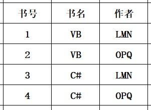

### 概念：

- 属性：
- 域：属性的取值范围。所有域所包含的都应是原子数据。
- “目” 或 “度”：属性的个数
- 候选码：能够唯一标识元组的属性。（相当于 unique key）
- 主码：（主键）
- 主属性：任何候选码都是主属性
- 外码：外键
- 全码：所有属性都是候选码。

#### 关系的类型：

- 基本关系：又称为基本表
- 查询表：查询结果对应的表
- 视图：又称为虚表

#### 完整性约束：

- 实体完整性：主键不能为 null
- 参照完整性：外键必须在相关联的主键中有相应的取值，或者取 null
- 用户自定义完整性：用户自定义约束

### 关系代数运算

#### 基本关系运算：

- 并：R ∪ S

- 差：R-S

- 笛卡尔积：X

- 投影：π

- 选择：σ
  
  *并和差要求关系具有相同的结构。*
  
  #### 扩展关系运算：

- 交：∩ （要求关系具有相同结构）

- 连接
  
  - θ连接：其中 θ 指连接条件 
  
  - 等值连接： 相当于 θ 为 “=”
  
  - 自然连接：使用同名属性进行等值连接，并且去掉重复属性列。
  
  - 除法：被除关系去掉共有属性后，剩下的每个元组的像集完全包含“除数关系”的元组即为结果集。
  
  - 广义投影：允许投影列表使用运算表达式
  
  - 外连接
  
  - 聚合函数
    
    *θ连接 和 等值连接 需要注意同名属性需要带上关系名作为前缀。*

### 元组运算

#### 元组的基本表达式

- R(t), R表示关系名，t表示 R 中的一个元组，$\{t|R(t)\}$该表达式的意思为所有关系R中的元组。

- t[i]表示元组变量，该表达式表示 t 元组的第 i 个分量

- $t[i] \theta C$ 或者 $t[i] \theta u[j]$ ，其中 θ 表示一种运算，比如 < 。该表达式表示满足该表达式的情况。

- $\forall t(\phi _1)$ 表示对于所有的 t ，都能够使得 $\phi _1$

- $\exists t(\phi _1)$ 表示存在的 t ，能够使得 $\phi _1$成立。

#### 关系代数和元组运算转化

- 并 $R \cup S = \{t|R(t) \lor S(t) \}$

- 交 $R \cap S = \{t|R(t) \land S(t) \}$

- 差 $R - S = \{t|R(t) \land \lnot S(t)\}$

- 投影: $\pi_{i_1,i_2,\cdots,i_n}R(t) = \{s|R(t) \land s[1]=t[i_1] \land \cdots \land s[n]=t[i_n] \}$

- 选择：$\sigma _FR(t)=\{R(t) \land F\}$ ,其中 $F$ 表示一个条件表达式

- 笛卡尔积：$R \times S = \{t|\exists R(u) \exists S(v) \land t[1]=u[i_1] \land \cdots \land t[m]=u[i_m] \land t[m+1]=v[j_1] \land \cdots \land t[m+n]=v[n]\}$

### 数据库范式：

这里的码是指候选码，一般出现低范式的原因都是一个关系中存在多个候选码。

- 第一范式：所有值域都只包含原子数据。

- 第二范式：所有非主属性完全依赖码，即消除了部分函数依赖。

- 第三范式：消除了非主属性对码的传递依赖。

- BCNF：满足3NF，消除主属性对候选键的传递依赖

- 4NF:消除多值依赖。
  
  #### 函数依赖：

Y 函数依赖于 X ： 表示为 X → Y。即表示每个 X 只能推出一个 Y （Y 可以相同）。 
部分函数依赖：AB能够推出C，A单独也能推出C，B单独也能推出C。 
完全函数依赖：AB能够推出C，A单独不能推出C，B单独不能推出C。 
依赖传递：X → Y，Y → Z，则 X → Z属于依赖传递。 
多值依赖: 关系R对应的属性集U，U包含 XYZ 三个部分，每个(X,Y)组合都对应着一组 Z 值，这组 Z 的值只与 X 有关，称为 Z 多值依赖于 X，X→→Z。 
冗余的函数依赖：在函数依赖集 F 中并且能够被其他的参数依赖推导出的函数依赖。 

部分函数依赖，传递依赖的例子：
该表的主键是（Sno,Pno）,但是 Sname,status完全依赖于 S1，部分依赖于（Sno,Pno）。
Ctiy 依赖于 status，所以city 传递依赖于 Sno

| Sno | Sname | Status（区号） | City | Pno | Qty |
| --- | ----- | ---------- | ---- | --- | --- |
| S1  | 精益    | 20         | 天津   | P1  | 200 |
| S1  | 精益    | 20         | 天津   | P2  | 300 |
| S1  | 精益    | 20         | 天津   | P3  | 480 |
| S2  | 盛锡    | 10         | 北京   | P1  | 168 |
| S2  | 盛锡    | 10         | 北京   | P3  | 500 |
| S3  | 东方红   | 40         | 上海   | P1  | 300 |
| S3  | 东方红   | 40         | 上海   | P2  | 280 |

不满足BCNF的例子：
存在关系：书号→书名， (书名、作者)→书号。
所以"书名"传递依赖于 (书名、作者)。 
 
应拆解为： 
 
多值依赖例子： 

其中 C →→ B，因为首先该关系已经是 BCNF 了，因为主键是 （C,T,B），并且不存在主属性对码的传递依赖。但是每组 （C,T）对应一组的 B，所以是多值依赖。

 
应拆解为 (C,T)，（C，B）
