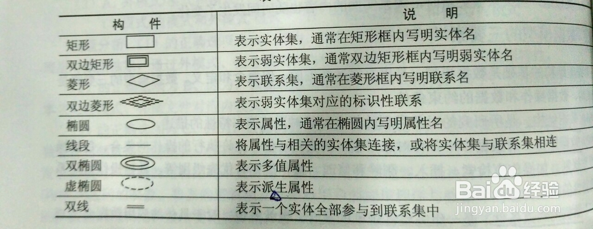
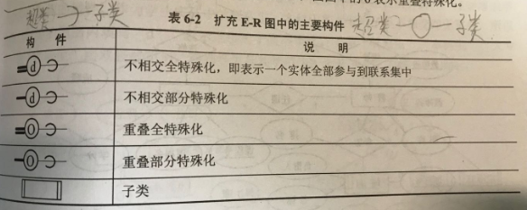

### 基础概念

- 关系模型是指用二维表（不是表格）的形式表示实体和实体间联系的数据模型。
- 数据库(DataBase，DB)是指长期储存在计算机外存上的、有组织的、可共享并相互联系的数据集合。
- 数据库中的数据按一定的数学模型组织、描述和储存，具有较小的冗余度，较高的数据独立性和易扩展性，并可为各种用户共享。（所以应用数据库主要解决数据的共享问题）

### 三级模式结构：

#### 数据抽象中的三级模式：

1. 物理层：描述数据在存储器中的存放方式。

2. 逻辑层：描述数据库中存储什么数据以及数据之间存在的关系。

3. 视图层：最高层次的抽象，描述整个数据库的某个部分。
   
   #### 数据库中的三级结构

4. 外模式：又称用户模式或子模式，是用户与数据库系统的接口。（相当于视图层）

5. 概念模式：是数据库中全部数据的逻辑结构和特征描述。（相当于逻辑层）

6. 内模式：也称存储模式，是数据物理结构和存储方式的描述。（相当于物理层）
   
   #### 三层结构的例子:
- 修改索引类型：修改的是存储模式（内模式）
  
  #### 两级映像：
  
  映像即mapping，由于三层结构实际上就是接口的思想，其中一层出现变化，只需要改动相关联的mapping，就不会影响其他层。
1. 模式/内模式的映像

2. 外模式/模式的映像
   
   数据独立性：

3. 数据的物理独立性：

4. 数据的逻辑独立性：

### E-R关系

#### 注意点：

- 属性只能依附于实体或联系用以刻画该实体或联系，而不能参与联系。

#### E-R关系分析的步骤及其作用：

- 分类：得到类型

- 聚集：所有对象进行分类，然后根据各类确定的实体，找出每一实体应具有的属性。

- 概括：聚集之后，从相关实体中抽象出子类和父类。
  
  #### E-R关系图例
  
   
  
  #### 扩充ER关系
  
  ##### 
  
  ##### 
  
  ##### 
  
  <b>在扩充ER关系中，联系可以被看作实体，参与另一个联系</b>
  
  特殊化：实体集按照某些特征区分为几个子实体集的过程。（逆向为“概括”）
  
  部分特殊化：该实体集中并非所有实体都属于特殊化实体
  
  重叠特殊化：该实体集中有部分实体属于多个子实体集。
  
  

### 大题解题思路

#### 补全 E-R 关系图

一般补全的是关系，所以检查对每个实体的描述，查看是否有缺失的关系。

#### 补全关系模式及确定主键

补全模式需要注意的地方：

- 一个空位可能需要填写多个属性

- 当需要填写的属性是外键时，应当填写外键引用实体的主键
  
  确定主键需要注意的地方

- 需要注意关系模式中是否有代理主键。

### 日志

设置日志检查点是为了提高一并恢复的效率。（设置检查点是指在设置从高速缓存中刷新到磁盘的时间）

### 故障恢复

#### 故障类型

- 事务故障：事务故障是非预期的，是不能由应用程序处理的故障。如运算溢出、并行事务发生死锁而被选中撤销该事务等。事务故障意味着事务没有到达预期的终点。

- 系统故障：系统故障是指造成系统停止运转的任何事件，使得系统重新启动。例如，中央处理器故障、操作系统故障、突然停电等。

- 介质故障：介质故障又称硬故障，是指外存故障，如磁盘的磁头碰撞、瞬时的强磁场干扰等。

#### 故障恢复操作

  故障恢复操作只需要使用日志。

- 系统故障恢复：由系统完成
  
  1. 正向扫描日志文件：找出在故障发生前已经提交的事务，将其事务标识记入重做（Redo）队列；同时找出故障发生时尚未完成的事务，将其事务标识记入撤销（Undo）队列。
  
  2. 对撤销队列中的各个事务进行撤销处理：反向扫描日志文件，对每个Undo事务的更新操作执行逆操作。
  
  3. 对重做队列中的各个事务进行重做处理：正向扫描日志文件，对每个Redo事务重新执行日志文件登记操作。
     
     事务故障恢复：反向扫描日志进行UNDO操作。

### 数据库安全

#### 安全控制机制：

自主存取控制是指以人为主体，用户可以自由地决定将数据的存取权限授予何人，并决定是否允许权限的传播。

#### 其他

ACID 中由并发子系统保证的是“一致性”。
