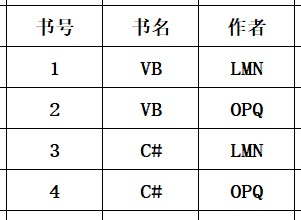
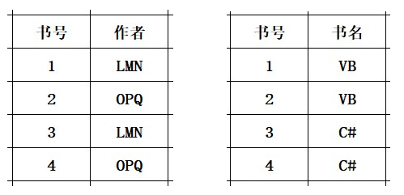
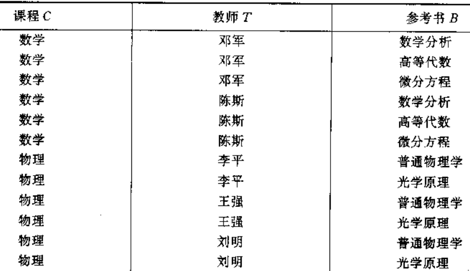

### 数据库范式：

这里的码是指候选码，一般出现低范式的原因都是一个关系中存在多个候选码。

- 第一范式：所有值域都只包含原子数据。

- 第二范式：所有非主属性完全依赖码，即消除了部分函数依赖。

- 第三范式：消除了非主属性对码的传递依赖。

- BCNF：满足3NF，消除主属性对候选键的传递依赖

- 4NF:消除多值依赖。
  
  #### 函数依赖：

Y 函数依赖于 X ： 表示为 X → Y。即表示每个 X 只能推出一个 Y （Y 可以相同）。 
部分函数依赖：AB能够推出C，A单独也能推出C，B单独也能推出C。 
完全函数依赖：AB能够推出C，A单独不能推出C，B单独不能推出C。 
依赖传递：X → Y，Y → Z，则 X → Z属于依赖传递。 
多值依赖: 关系R对应的属性集U，U包含 XYZ 三个部分，每个(X,Y)组合都对应着一组 Z 值，这组 Z 的值只与 X 有关，称为 Z 多值依赖于 X，X→→Z。 
冗余的函数依赖：在函数依赖集 F 中并且能够被其他的参数依赖推导出的函数依赖。 

部分函数依赖，传递依赖的例子：
该表的主键是（Sno,Pno）,但是 Sname,status完全依赖于 S1，部分依赖于（Sno,Pno）。
Ctiy 依赖于 status，所以city 传递依赖于 Sno

| Sno | Sname | Status（区号） | City | Pno | Qty |
| --- | ----- | ---------- | ---- | --- | --- |
| S1  | 精益    | 20         | 天津   | P1  | 200 |
| S1  | 精益    | 20         | 天津   | P2  | 300 |
| S1  | 精益    | 20         | 天津   | P3  | 480 |
| S2  | 盛锡    | 10         | 北京   | P1  | 168 |
| S2  | 盛锡    | 10         | 北京   | P3  | 500 |
| S3  | 东方红   | 40         | 上海   | P1  | 300 |
| S3  | 东方红   | 40         | 上海   | P2  | 280 |

不满足BCNF的例子：
存在关系：书号→书名， (书名、作者)→书号。
所以"书名"传递依赖于 (书名、作者)。 
 
应拆解为： 
 
多值依赖例子： 

其中 C →→ B，因为首先该关系已经是 BCNF 了，因为主键是 （C,T,B），并且不存在主属性对码的传递依赖。但是每组 （C,T）对应一组的 B，所以是多值依赖。

 
应拆解为 (C,T)，（C，B）

### Armstrong 公理系统

推理规则：

- 自反律

- 增广律

- 传递率，$X→Y,Y→Z,则X→Z$

- 合并规则，$X→Y,X→Z,则X→YZ$

- 伪传递率，$X→Y,WY→Z,则WX→Z$

- 分解规律，$X→Y,Z \subseteq Y,则X→Z$

#### 闭包

关系 R 中所有能够推理出的函数依赖的集合。表示为$F^+$

#### 求候选码

找出能够推导出所有属性的属性集合。注意不能存在该属性集合的子集也能够推出所有属性。

### 模式分解

#### 无损分解判断

##### 定义：通过自然连接所有的子关系，能够恢复到原来的关系的分解

##### 判断无损连接分解的算法

关键依据：存在函数依赖 X→Y，并且有两个或更多的子关系的属性集包含 X ，那么这些子关系中的 X 如果相等，那么这些子关系对应的 Y 也会相等。

##### 步骤：

1. 建立一张表，每一列对应一个属性记为 Aj，每一行对应一个子关系，记为Ri。如果 Aj 在 Rj 中，则该单元格记为 aj，否则记为 bij。
2. 该表中的 “a” 实际上表示，在以该行的子关系作为主表进行关联时，能够通过函数依赖推导出该属性的值。所以每个单元格可以通过两种方式或者 “a”，一个是子关系直接包含的属性，另一个是通过函数依赖推导出的属性。
3. 使用每个函数依赖更新该表，如果存在两个子关系包含依赖左侧所有的属性，并且对应的属性都相等，则把这两个子关系中在这个函数依赖右侧的属性更新成相同。更新的标准是如果任意子关系包含"aj"，则更新为"aj"，否则更新为 bij，其中i取较小值。
4. 当子关系只有两个时，可以直接采用公式$U_1 \cap U_2 → U_1 - U_2 \in F^+ 或者 U_1 \cap U_2 → U_2 - U_1 \in F^+$

**算法原理：** 

当存在子关系 $R_1(AB),R_2(AC)$,若父关系R中有依赖 $A→C$，则无损分解，因为当把$R_1和R_2$ 进行自然连接时，必然得到 $R(ABC)$，并且由于$R_2$存在依赖$A→C$，所有自然连接后的R依旧包含该依赖。所以，按照算法”遍历函数依赖集，找到某两行的共有属性包含某个函数依赖的左侧属性（比如$R_1(AB),R_2(AC)和A→C$），把函数依赖右侧的属性所在列更新成行索引最小的行的符号。“，这个两个统一的之后的结果，实际上就是进行自然连接之后的结果，如果某一行包含了函数依赖的右侧属性，则表示。

**算法2：**

1. 找出依赖集的候选键。

2. 找出包含候选键的子关系，并按照候选键进行自然连接，得到一个临时结果

3. 然后遍历剩下的函数依赖集，找到包含该函数依赖所有元素的子关系，查看该子关系和临时结果的共有属性是否为函数依赖左侧属性，是则合并，否则遍历下一个函数依赖。

4. 如果找不到能够继续合并的子关系，则终止算法。如果此时临时结果不包含所有元素则不是无损分解。

#### 函数依赖保持

<b>定义：所有子关系的依赖的并集与原关系的最小函数依赖等价。</b>

<b>通过反复使用保证无损连接性，又保证函数依赖的分解，能够保证分解之后至少能够达到3NF。</b>

### 水平分解，垂直分解
