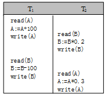

### 概念

解决并发操作带来不一致性的方法：封锁（加锁）、时间戳、乐观并发控制、悲观并发控制、多版本和快照隔离是并发控制主要采用的技术手段。

#### 二阶段锁协议

二阶段锁协议保证了可串行化调度。

#### 可串行化

串行调度：非交错地执行两个事务
可串行化：一个调度对数据库的状态的影响和某个串行调度相同，称为该调度具有可串行性。

非可串行化调度例子：

### 事务隔离级别分类：

事务隔离级别一般有四种：

1. Serializable (串行化)：可避免脏读、不可重复读、幻读的发生。
2. Repeatable read (可重复读)：可避免脏读、不可重复读的发生。但存在幻读。
3. Read committed (读已提交)：可避免脏读的发生。
4. Read uncommitted (读未提交)：最低级别，任何情况都无法保证。

四种事务隔离级别主要是影响事务开始时候调用select 语句对应的加锁逻辑，通过不同的加锁逻辑实现事务的隔离。

#### Read uncommitted 级别

    Read uncommitted 主要是指在该事务的隔离级别下，能够读到其他事务还未提交的更改。这种情况称为 “脏读”。比如说 Session1 对应 T1 insert 了一条数据但是还未 commit，如果此时 Session 2 在 Read Uncommitted 的级别下对 T1 select *，是能够查看到这条还未提交的记录。

#### Read committed 级别

    Read committed 能够避免出现脏读的情况，但是无法避免“幻读”。因为所以 Read Committed 能够保证读到的数据都是已经提交的，但是如果 Session 1 执行 “select * from T1 where id > 1”语句，执行完成之后 Session 2 执行了 “insert into T1 （id） values （2）” 语句并 commit ，则当 Session 1 再执行上面的语句就会多处一条记录。这就出现了幻读。幻读的影响主要是有可能造成有些满足条件的记录没有得到更改。

#### Repeatable read

    Repeatable read 能够避免 脏读，不可重复读。意思是在从事务的开始到结束同一条查询语句得到的结果集是相同的。

SQL-99的 Repeatable Read 是无法避免幻读，但是在 mysql 或者 SQL Server 通过 gap 锁的方式实现了对幻读的避免。

#### SERIALIZABLE

    SERIALIZABLE 级别比 Repeatable read 级别更高，并发程度更低。

#### 在 SQL server 的实现方法：

    Read uncommitted 能够读到其他session未提交的记录是因为，Read uncommitted通过与其他三个级别不同的入口实现读取。因为锁机制实际上是通过在指定的入口处检查资源是否能够获取的方式来实现同步，所以Read uncommitted 采用没有锁机制控制的入口来访问数据，就能够读取到修改了但是还未提交的数据。Read committed能够实现只能读取到已提交的更改是因为，sql server 中所有级别的写操作都会对对应的记录加上排他锁，所以即使 Read committed 不对查询的记录加锁也能够实现只读取已提交的数据。

    Repeatable read 实现的方式就是对查到的记录共享锁，并且如果有索引的话并且相应的查询 hit 中了索引就会在索引上加上相应的范围锁。但是sql server 的 Repeatable read 是不能够保证在没有使用到索引的查询语句的结果可重复性，因为在 sql server 中对没有使用到索引的查询只是对相应的记录加上了共享锁并且在对应的表上加上“意向共享锁”。此时其他的 session 依然能够对这张表添加数据。这样就会造成幻读的情况。

    所以在sql server 中只有在SERIALIZABLE级别才能够完全避免幻读的出现，因为SERIALIZABLE在没有使用到索引的情况下是直接对表添加共享锁，此时其他 session 是无法对该表进行修改了，从而完全避免了“幻读”。

