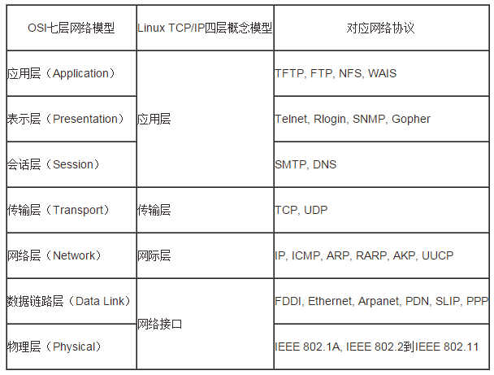
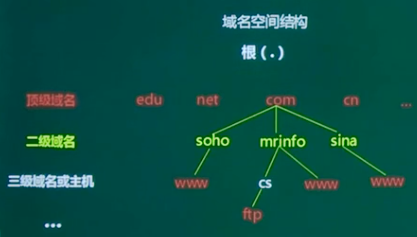
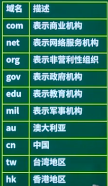

### 七层模型

#### 设备分层：

- 物理层：集线器，中继器（bit 为单位）
- 数据链路层：交换机（数据帧为单位）
- 网络层：路由器（包为单位）
- 传输层：以段为单位

#### 冲突域，广播域：

- 用Hub或者Repeater连接的所有节点可以被认为是在同一个冲突域内。连接在同一导线上的所有工作站的集合，或者说是同一物理网段上所有节点的集合或以太网上竞争同一带宽的节点集合。
- Hub，交换机等第一，第二层设备连接的节点被认为都是在同一个广播域。接收同样广播消息的节点的集合。

路由器是广播域的边界，每个路由器的端口对应一个广播域。交换机是冲突域的边界，每个交换机的端口对应一个冲突域。

#### OSI与TCP/IP模型层次对应关系

常用端口号：

- DNS: 53
- POP3: 110
- DHCP: 67/68
- SMTP: 25
- HTTP/HTTPS: 80/443
- TELNET: 23
- FTP: 20/21。21是控制端口，20是数据端口。

任何TCP实现的功能都用 1~1023端口。

### DNS 解析

#### DNS 解析顺序

DNS缓存→本地hosts文件→本地 DNS 服务器→根 DNS 服务器

#### 域名空间

#### 域名含义

#### 电子邮件服务

#### URL结构

#### 常见协议：

##### SNMP:

简单网络管理协议，该协议中，管理站和代理之间需要在相应的团体内才能够相互通信。
