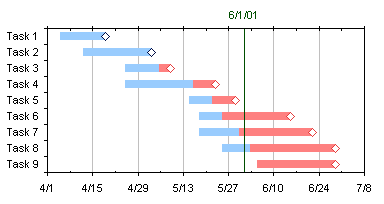
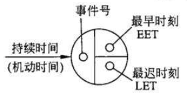

### 概念

#### 项目定义的三层意思
- 一定的资源约束
- 一定的目标
- 一次性任务

#### 成本估算
- $开发费用 = 人月数 \times 每个人月的代价$
- $开发费用 = 源代码行数 \times 每行平均费用$
- 三点估算法：$每个子项目的源代码行数 = 1/3可能最少的代码行数 + 1/3最大的代码行数 + 2/3最可能的代码行数$

#### 成本估算模型
- 普特南（Putnam）：动态多变量模型
- CoCoMo
  - 基本CoCoMo：静态单变量
  - 中级CoCoMo：静态多变量
  - 详细CoCoMo：将软件分为 系统、子系统和模块

### 进度管理
#### Gantt图
- 优点：能够清晰的描述每个任务的开始和结束时间。
- 缺点：不能反映任务的依赖关系。 
例子： 

#### Pert图
Pert图结构： 

##### Pert图概念
- 关键路径：最长时间的路径。决定了项目的时间
- Pert 不能清晰的描述任务的并行状态
- 注意“第几天开始”

### 风险控制
风险的优先级是根据风险暴露来设定的。

#### 人员管理
- 主程序员组：一名主程序员，一名后备程序员，一名资料员，若干程序员
- 无助程序员组：每个成员相互平等。缺点：沟通成本高，优点：发挥每个人的积极性
- 层次式程序员组：

#### 风险分析
- 目的：辅助项目组建立处理风险的策略
- 有效的风险策略需要考虑的问题：
  - 风险避免：最好的风险控制策略
  - 风险监控
  - 风险管理及应对计划

#### 控制风险的方法
- 降低风险：如安装防护措施
- 避免风险：如修改项目计划
- 转嫁风险：如购买保险
- 接受风险：如基于投入/产出的考虑
